````markdown
# Lead Intake AI System


AI-powered lead intake, qualification, voice capture, and business analysis automation platform built with n8n, Telegram, Google Sheets, OpenAI, and Whisper.

---

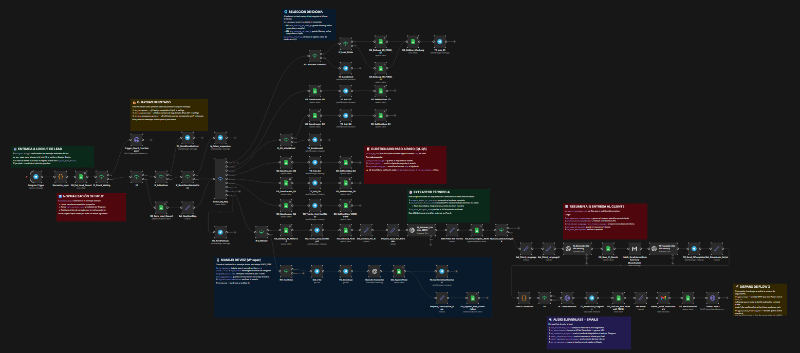

---

# Overview

The Lead Intake AI System is a modular automation architecture designed to capture, organize, enrich, and analyze client information through conversational workflows.

The platform combines:

* structured lead qualification
* multilingual interaction
* voice transcription
* AI-driven business analysis
* follow-up management
* automated reporting

The system was designed as a real-world automation solution focused on reducing manual intake processes and improving lead understanding before human consultation or sales engagement.

---

# Core Architecture

```text
FLOW_01_TELEGRAM_INTAKE
        ↓
FLOW_02_AI_ANALYSIS
        ↓
FLOW_03_FOLLOWUP_WINDOW
````

---

# Main Components

# FLOW_01 — Telegram Intake & Qualification

Handles:

* Telegram user interaction
* multilingual onboarding
* guided qualification questions
* voice note capture
* Whisper transcription
* lead state management
* Google Sheets synchronization
* initial AI summary generation

## Key Features

* Multilingual support (ES / EN)
* Text + Voice intake
* Dynamic step routing
* State machine handling
* Lead persistence
* Automated question flow

### Architecture Overview


### Voice Processing

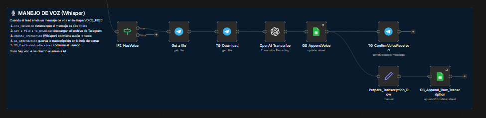

### AI Summary Generation

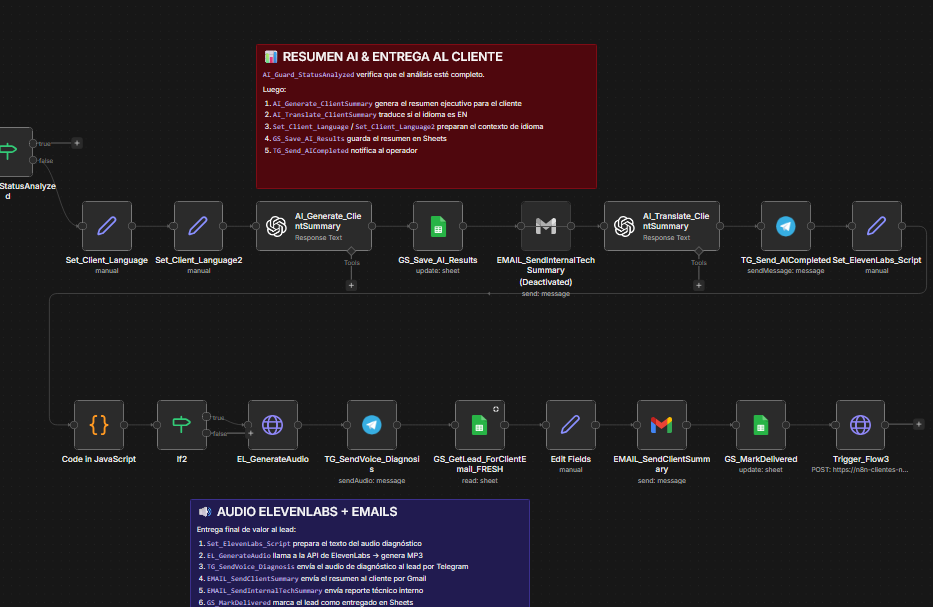

---

# FLOW_02 — AI Analysis Engine

Handles:

* context aggregation
* transcript consolidation
* incremental/deep AI analysis
* pricing preparation
* lead scoring
* AI report generation
* business complexity detection
* automated consultant summary generation

## Key Features

* Incremental analysis logic
* Context hashing
* AI business profiling
* Structured analysis pipeline
* Intelligent change detection
* Internal reporting generation

### Architecture Overview

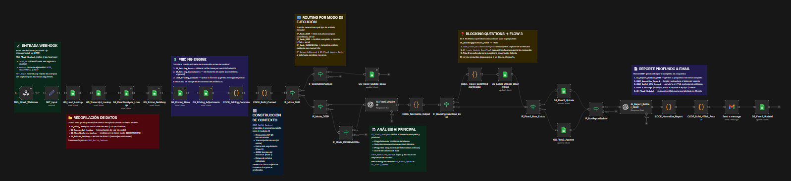

### Context Engine

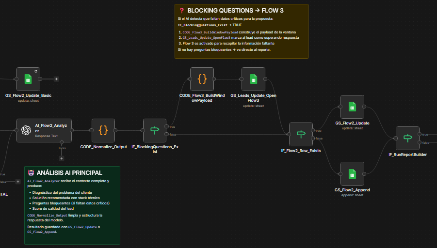

### Analysis Pipeline

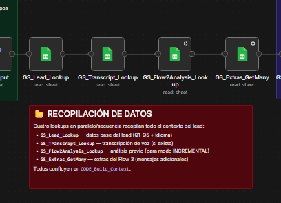

### Pricing Engine

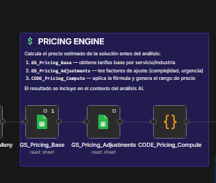

---

# FLOW_03 — Follow-Up Window Management

Handles:

* post-analysis information capture
* 24-hour follow-up window
* additional voice/text intake
* automatic timeout closure
* FLOW2 re-triggering
* lead reopening protection
* extra information registration

## Key Features

* Temporary follow-up windows
* Automatic expiration logic
* Additional context capture
* Controlled reprocessing
* Duplicate protection
* Voice extra processing

### Architecture Overview

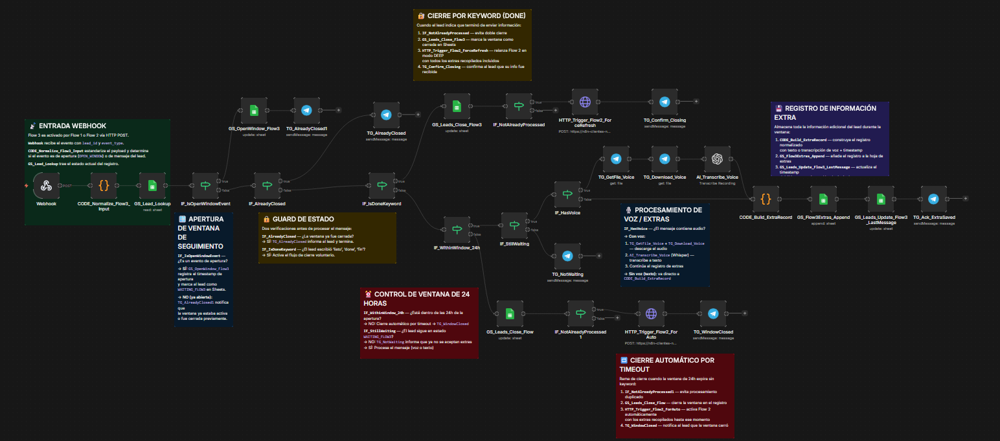

### Window Control

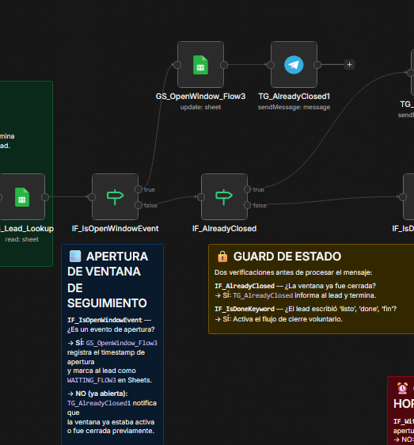

### Timeout Logic

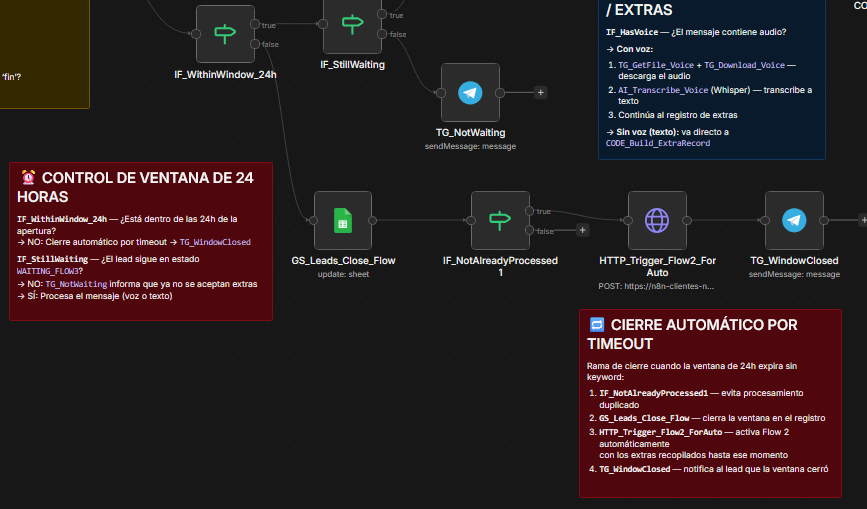

### Voice Extras Processing

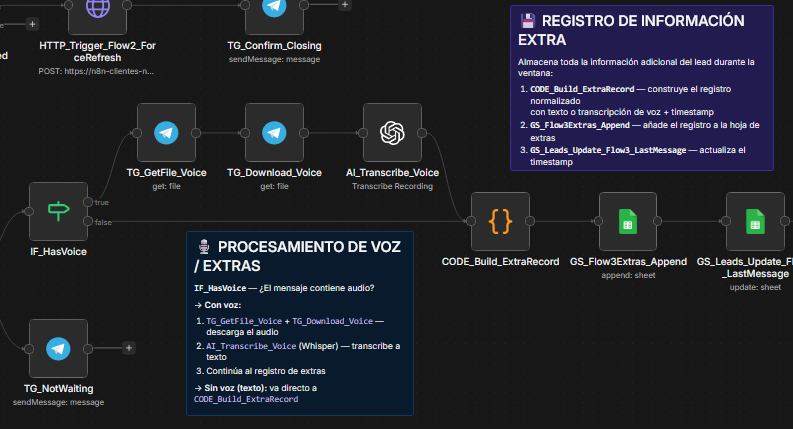

---

# Technologies Used

* n8n
* Telegram Bot API
* OpenAI API
* Whisper Transcription
* Google Sheets
* JavaScript
* HTTP Webhooks
* AI Prompt Engineering

---

# Project Structure

```text
lead-intake-ai-system/
│
├── README.md
├── 03_workflows_sanitized/
├── 04_database/
├── 05_architecture/
├── 06_assets/
└── .gitignore
```

---

# Security & Privacy

This repository is presented as a technical showcase and portfolio project.

Sensitive production elements are intentionally excluded, including:

* credentials
* tokens
* production endpoints
* complete prompts
* internal pricing logic
* production workflow configurations
* user/client data

---

# Current Status

## Status: Advanced Prototype / Production-Tested

The system has been tested with multiple real users and includes:

* working intake flows
* AI analysis pipeline
* follow-up automation
* voice transcription
* multilingual support
* automated reporting

Additional improvements planned:

* security hardening
* database migration
* advanced analytics
* CRM integrations
* web/mobile intake gateway
* vector memory & RAG expansion

---

# Future Roadmap

* Supabase migration
* Vector database integration
* RAG-based contextual analysis
* Advanced CRM synchronization
* Dashboard analytics
* Multi-tenant support
* HCS Input Gateway integration
* SaaS deployment architecture

---

# Author

Developed by HCS Logic
AI Automation & Business Process Engineering

Founder:
Hildegard Carradini Sanchez

---

# License

This repository is shared for portfolio and demonstration purposes only.

Commercial reuse, redistribution, or reproduction of proprietary workflow logic without authorization is not permitted.

```
```
